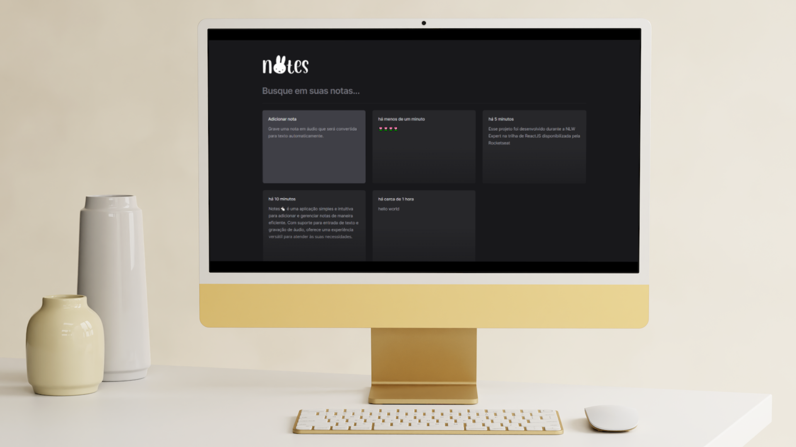

Notes🐇 é uma aplicação simples e intuitiva para adicionar e gerenciar notas de maneira eficiente. Com suporte para entrada de texto e gravação de áudio, oferece uma experiência versátil para atender às suas necessidades.

Esse projeto foi desenvolvido durante a <a href="https://app.rocketseat.com.br/events/nlw-expert/" style="color: #BB86FC;">NLW Expert</a>, disponibilizada pela <a href="https://www.rocketseat.com.br/" style="color: #BB86FC;">Rocketseat</a>.

## 💻 Tecnologias
- React
- TypeScript
- Vite
- Tailwind CSS
- Speech Recognition API

## 🔍 Visualização do projeto 
- Visualize o projeto no <strong>Vercel</strong> clicando na imagem:
<br>



<br>

<h4 style="text-align: center; color: #BB86FC">ou</h4>

<br>

- Clone este repositório em sua máquina local.
````
git clone https://github.com/ellen-caroline/notes-rocketseat.git
````

- Antes de começar, certifique-se de ter o Node.js instalado.
````
cd notes-rocketseat
npm install
````

- Inicie o servidor de desenvolvimento
````
npm run dev
````

- Abra o navegador e visite <a href="http://localhost:5173" style="color: #BB86FC;">http://localhost:5173</a> para ver o aplicativo em ação! 


## 🌷 Links úteis
- <a href="https://tailwindcss.com/docs/installation" style="color: #BB86FC;">Tailwind CSS</a>
- <a href="https://www.radix-ui.com" style="color: #BB86FC;">RadixUI</a>
- <a href="https://date-fns.org" style="color: #BB86FC;">Date FNS</a>
- <a href="https://lucide.dev/guide/installation" style="color: #BB86FC;">Lucide React</a>
- <a href="https://developer.mozilla.org/en-US/docs/Web/API/SpeechRecognition" style="color: #BB86FC;">Speech Recognition API</a>

<br>

<p style="text-align: center">🌷🌷🌷🌷</p>

